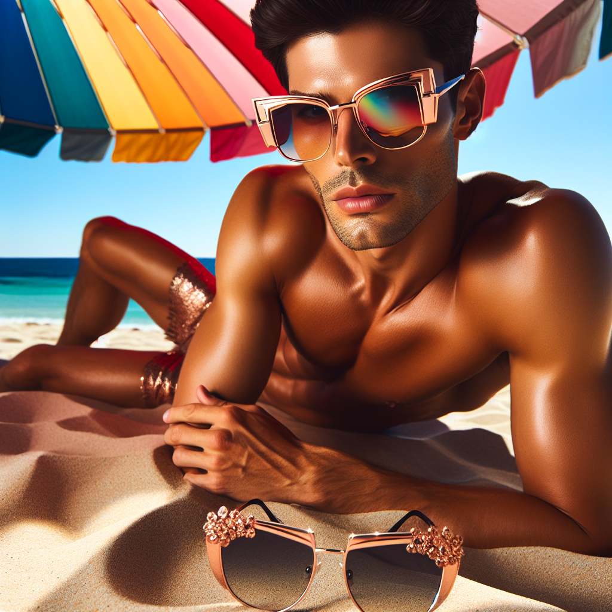

# 🕶️ Summer Sunglasses Campaign – Executive Summary

## 📊 Refined Trend Insights
### Summer 2024 Sunglasses Trends Summary 

As we prepare for the upcoming summer season, emerging trends in sunglasses reveal exciting opportunities for engagement and product positioning. Although direct access to the latest trend reports was unavailable, insights drawn from prior years indicate the following key trends for Summer 2024:

1. **Bold and Oversized Frames**  
   - **Overview**: Oversized sunglasses are set to reign, serving as both fashion statements and essential sun protection. These frames are designed to capture attention and exude personality.
   - **Color Palette**: Metallic finishes, particularly in gold and rose gold, are forecasted to dominate the market.

2. **Retro and Vintage Styles**  
   - **Overview**: Nostalgic designs reminiscent of the 70s and 90s—such as cat-eye and round frames—are experiencing a revival. These styles invite wearers to showcase their individuality and personal flair.
   - **Color Palette**: Classic tortoiseshell and vibrant hues are anticipated to be popular among consumers.

3. **Geometric Shapes**  
   - **Overview**: Innovative geometric designs that diverge from traditional aesthetics are becoming increasingly favored. This trend appeals to fashion-forward individuals seeking distinctive eyewear.
   - **Color Palette**: Expect to see an array of mirrored lenses and bold color contrasts that accentuate these unique shapes.

### Product Recommendations

To align our product offerings with these trends, we recommend the following selections:

1. **Bold and Oversized Frames**  
   - **Product**: **Oversized Glam Rose Gold** (SG006)  
     - **Description**: Glamorous oversized sunglasses featuring elegant rose gold accents.  
     - **Alignment**: These sunglasses perfectly embody the oversized trend while integrating the metallic finish central to Summer 2024 aesthetics.

2. **Retro and Vintage Styles**  
   - **Product**: **Round Vintage Tortoise** (SG002)  
     - **Description**: Classic round sunglasses fashioned from a stylish tortoiseshell frame.  
     - **Alignment**: This product captures the cherished vintage allure that resonates with customers seeking nostalgic fashion.

3. **Geometric Shapes**  
   - **Product**: **Geometric Modern Silver** (SG008)  
     - **Description**: Contemporary geometric sunglasses featuring striking mirrored lenses.  
     - **Alignment**: The modern geometric design is positioned as a must-have for the season, enhanced by the trendy mirrored lenses.

### Conclusion

For a striking Summer 2024 sunglasses campaign, we must emphasize our offerings of oversized frames, such as the **Oversized Glam Rose Gold**, vintage-inspired pieces like the **Round Vintage Tortoise**, and the chic **Geometric Modern Silver**. These products not only align with prevailing fashion trends but also cater to diverse consumer preferences while ensuring stylish sun protection.

## 🎯 Campaign Visual

## ✍️ Campaign Quote
> Turn Heads: Bold Shades, Endless Summer Vibes.

## ✅ Why This Works
The quote highlights the oversized, stylish sunglasses in the image that align with the summer 2024 trend of bold frames and metallic finishes.

---

*Report generated on 2025-11-23 at 17:51:57*
